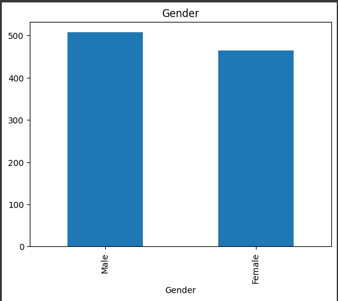
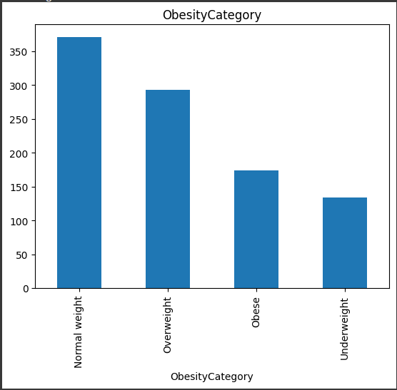
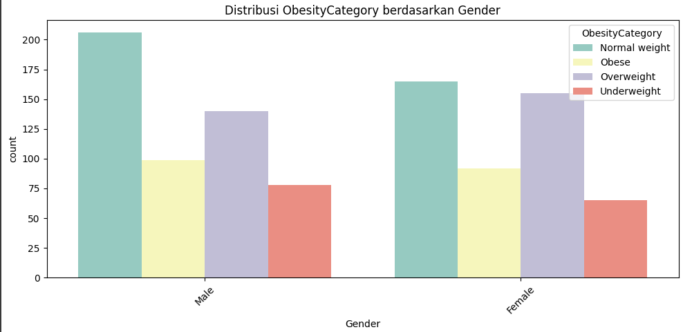
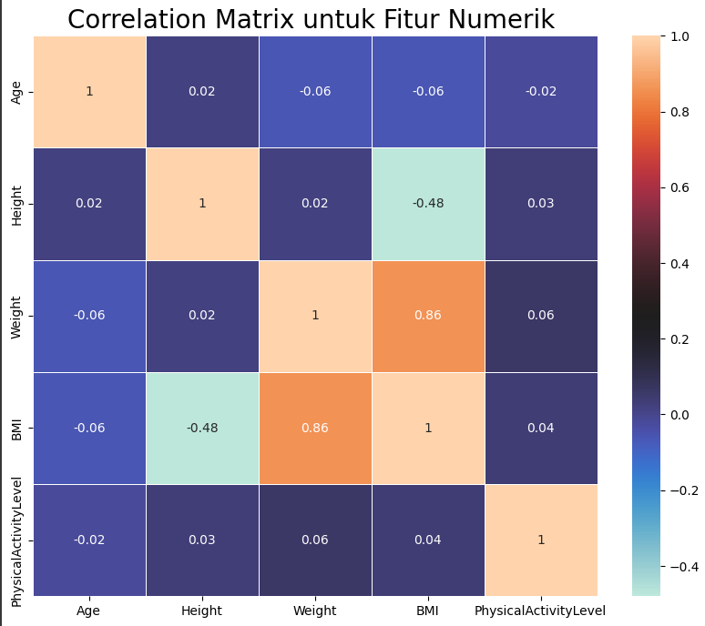

# Laporan Proyek Machine Learning klasifikasi Obesitas - Ahmad Musthofanur

## Domain Proyek

Obesitas merupakan salah satu masalah kesehatan masyarakat yang terus meningkat secara global. Kondisi ini tidak hanya memengaruhi kualitas hidup individu, tetapi juga meningkatkan risiko berbagai penyakit kronis seperti diabetes tipe 2, hipertensi, penyakit jantung, dan beberapa jenis kanker. Oleh karena itu, pemahaman yang lebih mendalam mengenai faktor-faktor yang berkontribusi terhadap obesitas menjadi sangat penting dalam upaya pencegahan dan penanganannya.

## Business Understanding
### Problem Statements

Menjelaskan pernyataan masalah latar belakang:
- Bagaimana karakteristik individu seperti usia, jenis kelamin, tinggi, berat badan, BMI, dan tingkat aktivitas fisik berkontribusi dalam mengklasifikasikan tingkat obesitas seseorang?
- Bagaimana memilih algoritma paling efektif untuk menghasilkan predisi klasifikasi tingkat obesitas yang dapat digunakan untuk mendukung pengambilan keputusan dalam layanan kesehatan?

### Goals

Menjelaskan tujuan dari pernyataan masalah:
- Mengembangkan model klasifikasi obesitas berdasarkan karakteristik individu menggunakan algoritma Support Vector Machine (SVM) dan K-Nearest Neighbors (KNN).
- Mengidentifikasi algoritma yang paling efektif dalam mengklasifikasikan obesitas dengan membandingkan performa model SVM dan KNN berdasarkan metrik evaluasi tertentu


## Data Understanding
Data yang digunakan dalam proyek ini merupakan data karakteristik individu yang mencakup variabel-variabel penting yang berkaitan dengan status obesitas. Setiap entri data merepresentasikan satu individu dan terdiri dari beberapa atribut utama, yaitu: usia, jenis kelamin, tinggi badan (dalam sentimeter), berat badan (dalam kilogram), indeks massa tubuh (BMI), tingkat aktivitas fisik, serta kategori obesitas yang telah diklasifikasikan berdasarkan nilai BMI. Data ini bersifat tabular dan disusun dalam format terstruktur, sehingga memungkinkan untuk dilakukan analisis statistik maupun eksplorasi hubungan antar variabel

- Sumber data yang digunakan berasal dari **Kaggle**: [UCI Machine Learning Repository](https://www.kaggle.com/datasets/mrsimple07/obesity-prediction).
- Dataset ini memiliki baris sebanyak 1000 dan 7 kolom
- Pada dataset yg dimiliki tidak terdapat missing value maupun data yg terduplikat namun ada beberapa outliers yg terdeteksi memlalui visualisasi boxplot, yaitu pada kolom height, weight dan BMI

**Penjelasan terhadap kolom-kolom dataset yg dimiliki**
- Age (Usia) – Usia individu dalam tahun, dengan rentang antara 18 hingga 79 tahun. Rata-rata usia dalam dataset ini adalah sekitar 49,9 tahun, yang menunjukkan bahwa data mencakup spektrum usia dewasa hingga lanjut usia.

- Gender (Jenis Kelamin) – Kategori nominal berupa 'Male' atau 'Female'.

- Height (Tinggi Badan) – Tinggi dalam satuan sentimeter, dengan rata-rata sekitar 170 cm. Rentang nilai tinggi mulai dari 136,1 cm hingga 201,4 cm, yang menunjukkan variasi tinggi badan yang cukup luas.

- Weight (Berat Badan) – Berat badan dalam kilogram, dengan rata-rata sekitar 71,2 kg. Nilai minimum adalah 26,06 kg dan maksimum mencapai 118,91 kg.

- BMI (Body Mass Index) – Indeks massa tubuh yang dihitung dari tinggi dan berat badan. Rata-rata BMI dalam data ini adalah 24,89 yang berada pada batas antara "normal weight" dan "overweight". Nilai BMI dalam dataset ini berkisar dari 8,47 hingga 50,79.

- PhysicalActivityLevel (Tingkat Aktivitas Fisik) – Merupakan nilai integer dari 1 sampai 4 yang merepresentasikan tingkat aktivitas fisik seseorang. Semakin tinggi nilainya, diasumsikan semakin aktif secara fisik. Rata-rata aktivitas fisik berada di level 2,53 yang mengindikasikan bahwa sebagian besar individu memiliki tingkat aktivitas sedang.

- ObesityCategory (Kategori Obesitas) – Merupakan klasifikasi status berat badan individu berdasarkan nilai BMI mereka. Kategori ini bisa mencakup "Underweight", "Normal weight", "Overweight", dan "Obese", meskipun distribusi tepat dari masing-masing kategori belum dijelaskan secara eksplisit.: [UCI Machine Learning Repository](https://www.kaggle.com/datasets/mrsimple07/obesity-prediction).

### Variabel-variabel pada Obesity dataset adalah sebagai berikut:
-  **`Age` (Usia)**  
   - **Tipe data:** Integer  

- **`Gender` (Jenis Kelamin)**  
   - **Tipe data:** Kategorikal (`Male`, `Female`)  

-  **`Height` (Tinggi Badan)**  
   - **Tipe data:** Float  

-  **`Weight` (Berat Badan)**  
   - **Tipe data:** Float  
- **`BMI` (Body Mass Index)**  
   - **Tipe data:** Float  
 
-  **`PhysicalActivityLevel` (Tingkat Aktivitas Fisik)**  
   - **Tipe data:** Integer  
   - **Skala:** 1 (tidak aktif) hingga 4 (sangat aktif)  

- **`ObesityCategory` (Kategori Obesitas)**  
   - **Tipe data:** Kategorikal (`Underweight`, `Normal weight`, `Overweight`, `Obese`)  
## Tahap Exploratory Data Analysis (EDA)
- Melakukan beberapa tahapan yang diperlukan untuk memahami data, contohnya teknik visualisasi data atau exploratory data analysis.
- Kode di bawah ini untuk melihat isi 5 kolom dan baris awal pertama pada dataset
```python
import pandas as pd
# Membaca dataset dari Google Drive
df = pd.read_csv('/content/drive/MyDrive/obesity/obesity_data.csv')
# Menampilkan 5 baris pertama dari dataset
df.head()
```
- Kode ini untuk memvisualisasikan kolom yg memiliki atau terindikasi adanya outliers dalam bentuk boxplot
```python 
sns.boxplot(x=df['Height'])
sns.boxplot(x=df['Weight'])
sns.boxplot(x=df['BMI'])
```

-   Kode ini untuk menangani outliers pada kolom Height, Weight dan BMI
```python
# Salin dataframe supaya data asli tetap aman
df_clean = df.copy()

# Loop untuk tiap fitur
for feature in df.select_dtypes(include='number'):
    Q1 = df_clean[feature].quantile(0.25)
    Q3 = df_clean[feature].quantile(0.75)
    IQR = Q3 - Q1

    lower_bound = Q1 - 1.5 * IQR
    upper_bound = Q3 + 1.5 * IQR

    # Filter data yang berada dalam batas normal
    df_clean = df_clean[(df_clean[feature] >= lower_bound) & (df_clean[feature] <= upper_bound)]

print(f"Jumlah data setelah hapus outlier: {df_clean.shape[0]}")
```
- **Insight:** dari kode di atas data jumlah data yg sebelunya 1000 setelah menangani outliers menjadi 972. mengindikasikan bahwa proses data cleaning atau pembersihan data telah dilakukan, khususnya dengan membuang data yang dianggap menyimpang (outlier).

- Kode ini untuk memvisualisasi jumlah sampel presentase kategori gender dalam bentuk bar
```python
feature = categorical_features[0]
count = df_clean[feature].value_counts()
percent = 100*df_clean[feature].value_counts(normalize=True)
df_sampel = pd.DataFrame({'jumlah sampel':count, 'persentase':percent.round(1)})
print(df_sampel)
count.plot(kind='bar', title=feature);
```
**Distribusi Gender:**



**Insight:** Bedasarn distribusi di atas kategori *Male* memiliki jumlah terbanyak dengan presentase 52.2% sedangkan *Female* memiliki presentase 47.8%
- kode ini untuk memvisualisasikan distribusi kategori obesitas
```python
feature = categorical_features[1]
count = df_clean[feature].value_counts()
percent = 100*df_clean[feature].value_counts(normalize=True)
df_sampel = pd.DataFrame({'jumlah sampel':count, 'persentase':percent.round(1)})
print(df_sampel)
count.plot(kind='bar', title=feature);
```
**Distribusi Obesitas:**



**Insight**: Dapat disimpulkan bahwa bedasarkan barplot di atas Normal weight yang terbanyak dibandingkan kategori obesitas yg lain

- kode ini adalah untuk visualisasi histogram
```pyhton
df.hist(bins=50, figsize=(20,15))
plt.show()
```
- kode ini adalah untuk visualisasi distribusi kategori obesitas bedasarkan Gender
```python
cat_features = df.select_dtypes(include='object').columns.to_list()
cat_features.remove("ObesityCategory")

for col in cat_features:
    plt.figure(figsize=(10, 5))
    sns.countplot(data=df, x=col, hue="ObesityCategory", palette="Set3")
    plt.title(f"Distribusi ObesityCategory berdasarkan {col}")
    plt.xticks(rotation=45)
    plt.tight_layout()
    plt.show()
```
**Distribusi obesitas bedasarkan Gender:**



**Insight:** Dari distibusi Gender di atas dapat dilihat bahwa *Male* cenderung lebih memiliki lebih banyak *Normalweight* dibanding *Female* dan *Female* lebih banyak memiliki kategori *Overweight* dibandingkan *Male*
- Kode ini untuk membuat visualisasi pairplot pada semua kolom numerik
```python
sns.pairplot(df, diag_kind = 'kde')
```
- kode ini membuat visualisasi heapmap atau korelasi pada setiap kolom numerik
```python
plt.figure(figsize=(10, 8))
correlation_matrix = df[numerical_features].corr().round(2)

# Untuk menge-print nilai di dalam kotak, gunakan parameter anot=True
sns.heatmap(data=correlation_matrix, annot=True, cmap='icefire', linewidths=0.5, )
plt.title("Correlation Matrix untuk Fitur Numerik ", size=20)
```
**Visualisasi heatmap korelasi:**



**Insight:** Terdapat korelasi yang sangat kuat antara Weight dan BMI (0.86), yang menunjukkan bahwa semakin berat seseorang, semakin tinggi nilai BMI-nya. Sementara itu, PhysicalActivityLevel memiliki korelasi yang sangat lemah terhadap semua fitur numerik lainnya. Hal ini mengindikasikan bahwa tingkat aktivitas fisik kemungkinan tidak berkaitan langsung dengan berat badan
## Data Preparation
Pada tahapan ini, dilakukan beberapa langkah untuk mempersiapkan data agar siap digunakan dalam pembuatan model. Setiap langkah bertujuan untuk memastikan kualitas data serta kelengkapan informasi yang diperlukan. Berikut adalah teknik yang digunakan
- Memuat dataset dari **kaggle**: tahap ini melakukan memuat dataset dari repository **kaggle** informasi dataset berupa `Age`, `Gender`, `Height`, `Weight`, `BMI`, `PhysicalActivityLevel`, `ObesityCategory`
- **Exploratory Data Analysis (EDA)**: Melakukan tahapan ekplorasi data, sepeti pengecekan dtype, melihat jumlah baris dan kolom, pengecekan missing value, pengecekan duplikasi data, dan mendeteksi outliers menggunakan visualisasi boxplot.
-  **Exploratory Data Analysis (EDA)** ***Univariate Analysis***: tahapan ini analisis yang hanya melibatkan satu variabel. tujuannya adalah untuk mendeskripsikan dan menganalisis distribusi dari variabel tersebut melakukan pemisahan tipe data yg berupa kategori dan juga numerikal guna memudahkan saat visualisasi bedasarkan dtypenya.
    - melihat distribusi `Gender`
    - melihat distribusi `ObesityCategory` 
    - melihat distibusi fitur numerik menggunakan visualisasi Hist
-  **Exploratory Data Analysis (EDA)** ***Univariate Analysis***: tahap ini bertujuan untuk melihat hubungan antara dua atau lebih variabel pada data
    - melihat distribusi `ObesityCategory` bedasarkan `Gender`
    - mebuat visualisasi pairpolot bedasarkan fitur numerik
    - melihat visualisasi korelasi menggunakan heatmap pada fitur numerik
- **Drop outlier pada** `Height`, `Weigth`, dan `BMI`: Pada tahapan EDA sebelumnya, pada visualisasi boxplot dapat terlihat data outlier pada `Heigth`, `Weigth`, dan juga `BMI`. ditangani menggunakan metode IQR yang mana data sebelumnya 1000 setelah melakukan penanganan data menjadi 972.

-  **Encoding**: Mengubah data kategorikal (`Gender` dan `ObesityCategory`) menjadi bentuk numerik agar bisa digunakan di algoritma machine learning.
-  **Split Fitur dan Target**: Memisahkan data fitur (`X`) dan target (`y`) untuk keperluan prediksi.
-  **Standardisasi**: Menyamaratakan skala data numerik menggunakan `StandardScaler` agar semua fitur setara secara statistik.

-  **Train-Test Split**: Membagi data menjadi 80% untuk pelatihan dan 20% untuk pengujian model.
""".

# Modeling
## Algoritma: SVM dan KNN

## 1. **Support Vector Machine (SVM)**
**Support Vector Machine (SVM)** adalah algoritma klasifikasi yang bertujuan untuk menemukan hyperplane terbaik yang memisahkan data dari berbagai kelas. Hyperplane ini adalah garis atau bidang dalam ruang fitur yang memisahkan dua kelas dengan margin terbesar. Dalam hal ini, kita menggunakan **SVC (Support Vector Classification)**, yang merupakan implementasi SVM untuk klasifikasi.
### Kode yang Digunakan
```python
from sklearn.svm import SVC

# Inisialisasi model SVM
svm = SVC(random_state=42)
```
Dalam kode ini, digunakan kelas `SVC` dari pustaka `sklearn.svm`, yang merupakan implementasi dari *Support Vector Classification*.

### Parameter Utama (Default)

- **`kernel`**: Fungsi yang digunakan untuk mengubah data ke dalam dimensi yang lebih tinggi agar bisa dipisahkan secara linear.  
  *Default*: `'rbf'` (Radial Basis Function), namun juga dapat menggunakan `'linear'`, `'poly'`, atau `'sigmoid'`.

- **`C`**: Parameter regularisasi.  
  Nilai `C` yang kecil akan membuat margin lebih lebar namun lebih toleran terhadap kesalahan klasifikasi.  
  *Default*: `1.0`.

- **`gamma`**: Parameter kernel untuk `'rbf'`, `'poly'`, dan `'sigmoid'`.  
  Semakin besar nilai `gamma`, model akan mencoba mempelajari pola detail dari data (berpotensi menyebabkan overfitting).  
  *Default*: `'scale'`.

- **`random_state`**: Digunakan untuk mengatur seed acak agar hasil eksperimen dapat direproduksi.  
  Dalam kode, diatur ke `42` untuk konsistensi.
---

## 2. **K-Nearest Neighbors (KNN)**
**K-Nearest Neighbors (KNN)** adalah algoritma klasifikasi yang bekerja dengan mencari *k* titik terdekat dari data uji dalam ruang fitur dan kemudian memberikan prediksi berdasarkan mayoritas kelas dari titik-titik terdekat tersebut. Model ini tidak memerlukan pelatihan eksplisit karena hanya menggunakan data latih untuk melakukan prediksi secara langsung saat data baru diberikan.
```python
from sklearn.neighbors import KNeighborsClassifier
knn = KNeighborsClassifier(n_neighbors=5)
knn.fit(X_train, y_train)
```
## Penjelasan Parameter utama (Default) KNeighborsClassifier

### **`n_neighbors`**
- **Deskripsi**: Menentukan jumlah tetangga terdekat yang digunakan untuk klasifikasi.
- **Nilai yang Ditetapkan**: `5`
- **Default**: **Tidak default**. Nilai `n_neighbors=5` ditentukan secara eksplisit dalam kode.
- **Default Parameter**: Jika tidak ditetapkan, nilai default untuk parameter ini adalah `5`. Artinya, jika kamu tidak menyebutkan `n_neighbors`, maka `5` akan digunakan secara otomatis.

### **`weights`**
- **Deskripsi**: Menentukan cara pemberian bobot pada tetangga yang digunakan.
  - `'uniform'`: Semua tetangga diberi bobot yang sama.
  - `'distance'`: Bobot diberikan berdasarkan jarak, semakin dekat tetangga, semakin tinggi bobotnya.
- **Default**: **Default** adalah `'uniform'`, jika tidak disebutkan dalam kode.

### **`algorithm`**
- **Deskripsi**: Menentukan algoritma yang digunakan untuk menemukan tetangga terdekat.
  - `'auto'`: Memilih algoritma terbaik berdasarkan data.
  - `'ball_tree'`: Menggunakan _Ball Tree_ untuk pencarian.
  - `'kd_tree'`: Menggunakan _KD Tree_.
  - `'brute'`: Mencari secara brute force tanpa struktur data khusus.
- **Default**: **Default** adalah `'auto'`.

### **`leaf_size`**
- **Deskripsi**: Mengatur ukuran daun dalam struktur data seperti _Ball Tree_ atau _KD Tree_.
- **Default**: **Default** adalah `30`.

### **`metric`**
- **Deskripsi**: Metrik yang digunakan untuk mengukur jarak antara titik data.
  - `'minkowski'`: Jarak standar (default).
  - `'euclidean'`: Jarak Euclidean.
  - `'manhattan'`: Jarak Manhattan.
- **Default**: **Default** adalah `'minkowski'`.


- Jika menggunakan dua atau lebih algoritma pada solution statement, maka pilih model terbaik sebagai solusi. **Jelaskan mengapa memilih model tersebut sebagai model terbaik**.

## Evaluation
# 📊 Hasil Proyek Berdasarkan Metrik Evaluasi

Proyek ini bertujuan untuk mengklasifikasikan individu ke dalam kategori **ObesityCategory** berdasarkan fitur-fitur seperti usia, jenis kelamin, tinggi badan, berat badan, BMI, dan tingkat aktivitas fisik. Dua algoritma klasifikasi telah diterapkan, yaitu **Support Vector Machine (SVM)** dan **K-Nearest Neighbors (KNN)**.

Evaluasi terhadap kedua model dilakukan menggunakan metrik-metrik klasifikasi utama: **Accuracy**, **Precision**, **Recall**, dan **F1-Score**.

### Apakah sudah menjawab setiap problem statment?
Model dilatih menggunakan fitur-fitur karakteristik individu, dan performanya diukur menggunakan data uji. Hasil akurasi serta metrik evaluasi lainnya menunjukkan bahwa fitur-fitur tersebut cukup representatif dalam memprediksi kategori obesitas.
### Apakah berhasil mencapai setiap goals yang diharapkan?
Tujuan membangun model klasifikasi obesitas berhasil dicapai dengan mengimplementasikan dua algoritma yaitu:

- **Support Vector Machine (SVM)**
- **K-Nearest Neighbors (KNN)**

- Kedua model diuji menggunakan data yang sama, dan hasilnya dibandingkan berdasarkan beberapa metrik evaluasi, seperti **accuracy**, **precision**, **recall**, dan **f1-score**.
- ### SVM

| Kelas          | Precision | Recall | F1-Score | Support |
|----------------|-----------|--------|----------|---------|
| Normal weight  | 0.95      | 0.99   | 0.97     | 73      |
| Obese          | 0.97      | 0.86   | 0.91     | 35      |
| Overweight     | 0.90      | 0.95   | 0.92     | 56      |
| Underweight    | 1.00      | 0.94   | 0.97     | 31      |

### KNN

| Kelas          | Precision | Recall | F1-Score | Support |
|----------------|-----------|--------|----------|---------|
| Normal weight  | 0.83      | 0.97   | 0.89     | 73      |
| Obese          | 0.94      | 0.83   | 0.88     | 35      |
| Overweight     | 0.87      | 0.86   | 0.86     | 56      |
| Underweight    | 0.96      | 0.71   | 0.81     | 31      |

### Apakah setiap solusi statement yang kamu rencanakan berdampak?
Dari hasil evaluasi, dapat disimpulkan bahwa **SVM lebih efektif** dalam mengklasifikasikan kategori obesitas dibandingkan KNN, ditunjukkan oleh nilai akurasi dan f1-score yang lebih tinggi.

Hal ini menunjukkan bahwa algoritma SVM mampu menangkap pola dalam data dengan lebih baik, khususnya saat memisahkan data dengan margin optimal. KNN, meskipun lebih sederhana, cenderung lebih sensitif terhadap noise dan performanya bergantung pada nilai `k` serta distribusi data.

### Kesimpulan Evaluasi
---
## 🔹 Hasil Model SVM
- **Akurasi**: `94.36%`
- **F1-Score Tertinggi**: 
  - Kategori *Normal weight*: `0.97`
  - Kategori *Underweight*: `0.97`
- **Precision Tertinggi**: 
  - Kategori *Underweight*: `1.00`
- **Recall Tertinggi**: 
  - Kategori *Normal weight*: `0.99`

### 📌 Interpretasi:
- Model SVM memberikan performa yang sangat baik dalam mengklasifikasikan seluruh kelas, terutama *Normal weight* dan *Underweight*, dengan F1-score hampir sempurna.
- Nilai precision dan recall yang tinggi menunjukkan bahwa model ini tidak hanya mampu membuat prediksi yang tepat, tetapi juga mampu menangkap sebagian besar sampel aktual dari masing-masing kelas.

---

## 🔹 Hasil Model KNN

- **Akurasi**: `87.18%`
- **F1-Score Tertinggi**: 
  - Kategori *Normal weight*: `0.89`
- **Precision Tertinggi**: 
  - Kategori *Underweight*: `0.96`
- **Recall Terendah**: 
  - Kategori *Underweight*: `0.71`

### 📌 Interpretasi:
- Model KNN menunjukkan performa klasifikasi yang cukup baik namun tidak seakurat SVM.
- Recall yang rendah pada kategori *Underweight* menunjukkan bahwa model sering gagal mengenali kelas ini meskipun precision-nya tinggi (prediksi yang dilakukan umumnya benar).
- Model KNN cocok digunakan sebagai baseline atau pembanding.

---

## 🧾 Kesimpulan
 dapat disimpulkan bahwa **SVM lebih efektif** dalam mengklasifikasikan kategori obesitas dibandingkan KNN
| Metrik Evaluasi     | SVM     | KNN     |
|---------------------|---------|---------|
| Akurasi             | 94.36%  | 87.18%  |


- Berdasarkan metrik evaluasi, model **SVM** menunjukkan performa yang lebih baik secara keseluruhan dibandingkan **KNN**.
- SVM lebih konsisten dalam menghasilkan precision dan recall tinggi di seluruh kelas, menjadikannya model yang **paling direkomendasikan** untuk digunakan dalam kasus klasifikasi kategori obesitas ini.

---


